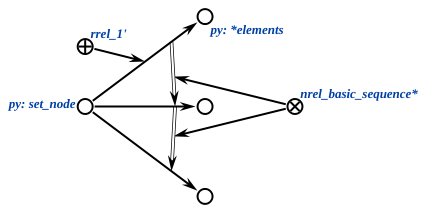
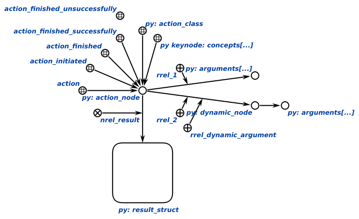

# py-sc-kpm

The python implementation of the knowledge processing machine (kpm)
for [sc-machine](https://github.com/ostis-ai/sc-machine).
Library provides tools for interacting with knowledge bases.
Communication with server is implemented in separate library
named [py-sc-client](https://github.com/ostis-ai/py-sc-client).
This module is compatible with 0.7.0 version
of [OSTIS Technology platform](https://github.com/ostis-ai/ostis-web-platform).

# API Reference

## Classes

The library contains the python implementation of useful classes and functions to work with the sc-memory.

There is a list of classes:

- ScKeynodes
- ScAgent
- ScModule
- ScServer


### ScKeynodes

A singleton dictionary object which provides the ability
to cache the identifier and ScAddr of keynodes stored in the KB.
Create an instance of the ScKeynodes class to get access to the cache:

```python
from sc_kpm import ScKeynodes

keynodes = ScKeynodes()
```

Get the provided identifier:

```python
keynodes["identifier_of_keynode"]  # returns an ScAddr of the given identifier
keynodes["not_stored_in_kb"]  # returns an invalid ScAddr if an identifier does not exist in the memory
```

Use _resolve()_ method to resolve identifiers:

```python
my_class_node = keynodes.resolve("my_class_node", sc_types.NODE_CONST_CLASS)
```

### ScAgent

A class for handling a single ScEvent. Define your agents like this:

```python
from sc_kpm import ScAgent


class ScAgentTest(ScAgent):
    def on_event(self, _src, _edge, target_node) -> ScResult:
        logger.info("%s is started", ScAgentTest.__name__)
        ...
        return ScResult.OK
```

### ScModule

A class for registration and handling multiple ScAgent objects. Define your modules like this:

```python
from sc_kpm import ScModule
from sc_kpm.common.sc_module import RegisterParams
from sc_client.constants.common import ScEventType


class ScModuleTest(ScModule):
    _reg_params = [
        RegisterParams(ScAgentTest, "action_node", ScEventType.ADD_OUTGOING_EDGE)
    ]

```

### ScServer

A class for serving ScModule objects. Initialize and run server like this:

```python
from sc_kpm import ScServer

SC_SERVER_URL = "ws://localhost:8090/ws_json"
server = ScServer(SC_SERVER_URL)
server.start()
...
```

You can register your modules wherever you want. Manage your modules like this:

```python
module = ScModuleTest()
server.add_modules(module)
...
server.remove_modules(module)
...
```

After stopping server, all modules and agents will be deactivated.

```python
server.stop()
...
```

## Utils

There are some functions for working with nodes, edges, links: create them, search, get content, delete, etc.
There is also possibility to wrap in set or oriented set.

## Common utils

There are utils to work with basic elements

### Nodes creating

```python
def create_node(node_type: ScType, sys_idtf: str = None) -> ScAddr: ...


def create_nodes(*node_types: ScType) -> List[ScAddr]: ...
```

Create one or more nodes with type setting.
`sys_idtf` is optional name of keynode if you want to add it there.

```python
from sc_kpm import sc_types, ScKeynodes
from sc_kpm.utils.common_utils import create_node, create_nodes

lang = create_node(sc_types.NODE_CONST_CLASS)  # ScAddr(...)
lang_en = create_node(sc_types.NODE_CONST_CLASS, "lang_en")  # ScAddr(...)
assert lang_en == ScKeynodes()["lang_en"]
elements = create_nodes(sc_types.NODE_CONST, sc_types.NODE_VAR)  # [ScAddr(...), ScAddr(...)]
```

### Edges creating

```python
def create_edge(edge_type: ScType, src: ScAddr, trg: ScAddr) -> ScAddr: ...
```

Create edge between src and trg with setting its type

```python
from sc_kpm import sc_types
from sc_kpm.utils.common_utils import create_nodes
from sc_kpm.utils.common_utils import create_edge

src, trg = create_nodes(*[sc_types.NODE_CONST] * 2)
msg_edge = create_edge(sc_types.EDGE_ACCESS_CONST_POS_PERM, src, trg)  # ScAddr(...)
assert src.is_valid() and trg.is_valid() and msg_edge.is_valid()
```

### Links creating

```python
def create_link(
        content: Union[str, int],
        content_type: ScLinkContentType = ScLinkContentType.STRING,
        link_type: ScType = sc_types.LINK_CONST
) -> ScAddr: ...


def create_links(
        *contents: Union[str, int],
        content_type: ScLinkContentType = ScLinkContentType.STRING,
        link_type: ScType = sc_types.LINK_CONST,
) -> List[ScAddr]: ...
```

Create link with some content, default type: string

```python
from sc_kpm import sc_types
# from sc_kpm import sc_models
from sc_kpm.utils.common_utils import create_link, create_links

msg = create_link("hello")  # ScAddr(...)
# four = create_link(4, sc_models.ScLinkContentType.INT)  # ScAddr(...) // idk, mb it ain't work
water = create_link("water", link_type=sc_types.LINK_VAR)  # ScAddr(...)
names = create_links("Sam", "Pit")  # [ScAddr(...), ScAddr(...)]
```

### Relations creating

```python
def create_binary_relation(edge_type: ScType, src: ScAddr, trg: ScAddr, *relations: ScAddr) -> ScAddr: ...


def create_role_relation(src: ScAddr, trg: ScAddr, *rrel_nodes: ScAddr) -> ScAddr: ...


def create_norole_relation(src: ScAddr, trg: ScAddr, *nrel_nodes: ScAddr) -> ScAddr: ...
```

Create binary relations with different relations

```python
from sc_kpm import sc_types, ScKeynodes
from sc_kpm.common.identifiers import CommonIdentifiers
from sc_kpm.utils.common_utils import create_node, create_nodes
from sc_kpm.utils.common_utils import create_binary_relation, create_role_relation, create_norole_relation

src, trg = create_nodes(*[sc_types.NODE_CONST] * 2)
increase_relation = create_node(sc_types.NODE_CONST_CLASS, "increase")

brel = create_binary_relation(sc_types.EDGE_ACCESS_CONST_POS_PERM, src, trg, increase_relation)  # ScAddr(...)
rrel = create_role_relation(src, trg, ScKeynodes[CommonIdentifiers.RREL_ONE.value])  # ScAddr(...)
nrel = create_norole_relation(src, trg, create_node(sc_types.NODE_CONST_NOROLE, "connection"))  # ScAddr(...)
```

### Deleting utils

```python
def delete_elements(*addrs: ScAddr) -> bool: ...


def delete_edges(source: ScAddr, target: ScAddr, *edge_types: ScType) -> bool: ...
```

Delete elements or all edges between nodes by their type and return success

```python
from sc_kpm import sc_types
from sc_kpm.utils.common_utils import create_nodes, create_edge
from sc_kpm.utils.common_utils import delete_edges, delete_elements

elements = create_nodes(*[sc_types.NODE_CONST] * 2)
delete_elements(*elements)  # True

src, trg = create_nodes(*[sc_types.NODE_CONST] * 2)
edge = create_edge(sc_types.EDGE_ACCESS_CONST_POS_PERM, src, trg)
delete_edges(src, trg, sc_types.EDGE_ACCESS_CONST_POS_PERM)  # True
```

### Getting edges

_**NOTE: Use VAR type instead of CONST in getting utils**_

```python
def get_edge(source: ScAddr, target: ScAddr, edge_type: ScType) -> ScAddr: ...


def get_edges(source: ScAddr, target: ScAddr, *edge_types: ScType) -> List[ScAddr]: ...
```

Get edge or edges between two nodes

```python
from sc_kpm import sc_types
from sc_kpm.utils.common_utils import create_nodes, create_edge
from sc_kpm.utils.common_utils import get_edge, get_edges

src, trg = create_nodes(*[sc_types.NODE_CONST] * 2)
edge1 = create_edge(sc_types.EDGE_ACCESS_CONST_POS_PERM, src, trg)
edge2 = create_edge(sc_types.EDGE_D_COMMON_VAR, src, trg)

class_edge = get_edge(src, trg, sc_types.EDGE_ACCESS_VAR_POS_PERM)  # ScAddr(...)
assert class_edge == edge1
edges = get_edges(src, trg, sc_types.EDGE_ACCESS_VAR_POS_PERM, sc_types.EDGE_D_COMMON_VAR)  # [ScAddr(...), ScAddr(...)]
assert edges == [edge1, edge2]
```

### Getting by role relation

```python
def get_element_by_role_relation(src: ScAddr, rrel_node: ScAddr) -> ScAddr: ...
```

Get target by node and role relation edge

```python
from sc_kpm import sc_types, ScKeynodes
from sc_kpm.common.identifiers import CommonIdentifiers
from sc_kpm.utils.common_utils import create_nodes, create_role_relation
from sc_kpm.utils.common_utils import get_element_by_role_relation

src, trg = create_nodes(*[sc_types.NODE_CONST] * 2)
rrel = create_role_relation(src, trg, ScKeynodes[CommonIdentifiers.RREL_ONE.value])  # ScAddr(...)

result = get_element_by_role_relation(src, ScKeynodes[CommonIdentifiers.RREL_ONE.value])  # ScAddr(...)
assert result == trg
```

### Getting link content

```python
def get_link_content(link: ScAddr) -> Union[str, int]: ...
```

```python
from sc_kpm.utils.common_utils import create_link
from sc_kpm.utils.common_utils import get_link_content

water = create_link("water")
content = get_link_content(water)  # "water"
```

### Getting system identifier

```python
def get_system_idtf(addr: ScAddr) -> str: ...
```

Get system identifier of keynode

```python
from sc_kpm import sc_types, ScKeynodes
from sc_kpm.utils.common_utils import create_node
from sc_kpm.utils.common_utils import get_system_idtf

lang_en = create_node(sc_types.NODE_CONST_CLASS, "lang_en")  # ScAddr(...)
idtf = get_system_idtf(lang_en)  # "lang_en"
assert ScKeynodes()[idtf] == lang_en
```

## Generation utils

There are functions to work with sets: create, wrap, etc.

### Set and structure creating

```python
def wrap_in_set(set_node: ScAddr, *elements: ScAddr) -> None: ...


def create_set(set_type: ScType, *elements: ScAddr) -> ScAddr: ...


def create_structure(*elements: ScAddr) -> ScAddr: ...
```

Set consists of elements and set node that connects them.


In structure sc_type of main node is `sc_types.NODE_CONST_STRUCT`


```python
from sc_kpm import sc_types
from sc_kpm.utils.common_utils import create_node, create_nodes
from sc_kpm.utils.generation_utils import wrap_in_set, create_set, create_structure

elements = create_nodes(sc_types.NODE_CONST, sc_types.NODE_VAR)

set_node = create_node(sc_types.NODE_CONST_CLASS)
wrap_in_set(set_node, *elements)  # None
# or
set_node = create_set(sc_types.NODE_CONST, *elements)  # ScAddr(...)
# or
struct_node = create_structure(*elements)  # ScAddr(...)
```

### Oriented set creating

```python
def wrap_in_oriented_set(set_node: ScAddr, start_element: ScAddr, *elements: ScAddr) -> None: ...


def create_oriented_set(*elements: ScAddr) -> ScAddr: ...
```

Oriented set is more complex, but is has orientation


```python
from sc_kpm import sc_types
from sc_kpm.utils.common_utils import create_node, create_nodes
from sc_kpm.utils.generation_utils import wrap_in_oriented_set, create_oriented_set

elements = create_nodes(sc_types.NODE_CONST, sc_types.NODE_VAR)

set_node = create_node(sc_types.NODE_CONST_CLASS)
wrap_in_oriented_set(set_node, *elements)  # None
# or
set_node = create_oriented_set(*elements)  # ScAddr(...)
```

## Search utils

There are utils fot searching elements of sets and their power

### Getting sets elements

```python
def get_set_elements(set_node: ScAddr) -> List[ScAddr]: ...


def get_oriented_set_elements(set_node: ScAddr) -> List[ScAddr]: ...
```

Get elements of set and oriented set by set node

```python
from sc_kpm import sc_types
from sc_kpm.utils.common_utils import create_nodes
from sc_kpm.utils.generation_utils import create_structure, create_oriented_set
from sc_kpm.utils.search_utils import get_set_elements, get_oriented_set_elements

elements = create_nodes(sc_types.NODE_CONST, sc_types.NODE_VAR)
struct_node = create_structure(*elements)
search_results = get_set_elements(struct_node)  # [ScAddr(...), ScAddr(...)]
assert search_results == elements

elements = create_nodes(sc_types.NODE_CONST, sc_types.NODE_VAR)
set_node = create_oriented_set(*elements)
search_results = get_oriented_set_elements(set_node)  # [ScAddr(...), ScAddr(...)]
assert search_results == elements
```

### Getting set power

```python
def get_set_power(set_node: ScAddr) -> int: ...
```

Get count os elements in set or oriented set

```python
from sc_kpm import sc_types
from sc_kpm.utils.common_utils import create_nodes
from sc_kpm.utils.generation_utils import create_structure
from sc_kpm.utils.search_utils import get_set_power

elements = create_nodes(sc_types.NODE_CONST, sc_types.NODE_VAR)
struct_node = create_structure(*elements)

power = get_set_power(struct_node)  # 2
assert power == len(elements)
```

## Action utils

Utils to work with actions, events and agents



### Check action class

```python
def check_action_class(action_class: Union[ScAddr, Idtf], action_node: ScAddr) -> bool: ...
```

True if action class has connection to action node.
You can use identifier of action class instead of ScAddr


```python
from sc_kpm import sc_types, ScKeynodes
from sc_kpm.common.identifiers import CommonIdentifiers
from sc_kpm.utils.common_utils import create_node, create_edge
from sc_kpm.utils.action_utils import check_action_class

action_node = create_node(sc_types.NODE_CONST)
create_edge(sc_types.EDGE_ACCESS_CONST_POS_PERM, ScKeynodes()[CommonIdentifiers.QUESTION.value], action_node)
action_class = create_node(sc_types.NODE_CONST_CLASS, "some_classification")
create_edge(sc_types.EDGE_ACCESS_CONST_POS_PERM, action_class, action_node)

assert check_action_class(action_class, action_node)  # True
# or
assert check_action_class("some_classification", action_node)  # True
```

### Get action answer

```python
def get_action_answer(action_node: ScAddr) -> ScAddr: ...
```

Get structure with output of action


```python
from sc_kpm import sc_types, ScKeynodes
from sc_kpm.common.identifiers import CommonIdentifiers
from sc_kpm.utils.common_utils import create_node, create_edge
from sc_kpm.utils.action_utils import get_action_answer

action_node = create_node(sc_types.NODE_CONST)
answer_struct = create_node(sc_types.NODE_CONST_STRUCT)
edge = create_edge(sc_types.EDGE_D_COMMON_CONST, action_node, answer_struct)
create_edge(sc_types.EDGE_ACCESS_CONST_POS_PERM, ScKeynodes()[CommonIdentifiers.NREL_ANSWER.value], edge)

result = get_action_answer(action_node)
assert result == answer_struct
```

### Call and execute agent

```python
def call_agent(
        arguments: Dict[ScAddr, IsDynamic],
        concepts: List[Idtf],
        initiation: Idtf = QuestionStatus.QUESTION_INITIATED.value,
) -> ScAddr: ...


def execute_agent(
        arguments: Dict[ScAddr, IsDynamic],
        concepts: List[Idtf],
        initiation: Idtf = QuestionStatus.QUESTION_INITIATED.value,
        reaction: QuestionStatus = QuestionStatus.QUESTION_FINISHED_SUCCESSFULLY,
        wait_time: int = COMMON_WAIT_TIME,  # 5
) -> bool: ...
```

Call agent, wait for it some seconds, and return if there is reaction


```python
from sc_client.models import ScLinkContentType

from sc_kpm import ScAgent, ScKeynodes, ScModule, ScServer
from sc_kpm.common.identifiers import CommonIdentifiers, QuestionStatus
from sc_kpm.common.sc_result import ScResult
from sc_kpm.utils.action_utils import (
    ScAddr,
    call_agent,
    check_action_class,
    execute_agent,
    finish_action_with_status,
    get_action_answer,
    wait_agent,
)
from sc_kpm.utils.common_utils import (
    create_link,
    create_norole_relation,
    get_element_by_role_relation,
    get_link_content,
)
from sc_kpm.utils.creation_utils import create_structure
from sc_kpm.utils.retrieve_utils import get_set_elements

logs = []


class SumScAgent(ScAgent):
    ACTION_CLASS_NAME = "sum"

    def __init__(self):
        self.keynodes = ScKeynodes()
        self.action_class = self.keynodes.resolve(self.ACTION_CLASS_NAME)

    def on_event(self, class_node: ScAddr, edge: ScAddr, action_node: ScAddr) -> ScResult:
        logs.append("run agent")
        if not check_action_class(self.action_class, action_node):
            return ScResult.SKIP
        result = self.run(action_node)
        finish_action_with_status(action_node, is_success=(result == ScResult.OK))
        return result

    def run(self, action_node: ScAddr) -> ScResult:
        arg1_link = get_element_by_role_relation(action_node, self.keynodes[CommonIdentifiers.RREL_ONE.value])
        arg2_link = get_element_by_role_relation(action_node, self.keynodes[CommonIdentifiers.RREL_TWO.value])
        arg1_content = get_link_content(arg1_link)
        arg2_content = get_link_content(arg2_link)
        logs.append([arg1_content, arg2_content, type(arg1_content), type(arg2_content)])
        if not isinstance(arg1_content, int) or not isinstance(arg2_content, int):
            return ScResult.ERROR_INVALID_TYPE
        answer_struct_node = create_structure(create_link(arg1_content + arg2_content, ScLinkContentType.INT))
        create_norole_relation(action_node, answer_struct_node, self.keynodes[CommonIdentifiers.NREL_ANSWER.value])
        return ScResult.OK


server = ScServer("ws://localhost:8090/ws_json")
server.start()
keynodes = ScKeynodes()

module = ScModule()
module.add_agent(SumScAgent)
server.add_modules(module)

arg1 = create_link(2, ScLinkContentType.INT)
arg2 = create_link(3, ScLinkContentType.INT)
kwargs = {
    "arguments": {arg1: False, arg2: False},
    "concepts": [SumScAgent.ACTION_CLASS_NAME, CommonIdentifiers.QUESTION.value],
}

question, is_successfully = execute_agent(**kwargs)
assert is_successfully
# or
question = call_agent(**kwargs)
wait_agent(2, question, keynodes[QuestionStatus.QUESTION_FINISHED.value])

answer_struct = get_action_answer(question)
answer_link = get_set_elements(answer_struct)[0]
answer_content = get_link_content(answer_link)
logs.append({"answer_content": answer_content})

print(logs)

module.unregister()
server.remove_modules(module)
server.stop()

```

### Finish action

```python
def finish_action(action_node: ScAddr, status: QuestionStatus = QuestionStatus.QUESTION_FINISHED) -> ScAddr: ...


def finish_action_with_status(action_node: ScAddr, is_success: bool = True) -> None: ...
```

Function `finish_action` connects status class to action node.
`finish_action_with_status` connects `question_finished` and `question_finished_(un)successfully` statuses to it.


```python
from sc_kpm import sc_types, ScKeynodes
from sc_kpm.common.identifiers import QuestionStatus
from sc_kpm.utils.common_utils import create_node, check_edge
from sc_kpm.utils.action_utils import finish_action, finish_action_with_status

action_node = create_node(sc_types.NODE_CONST)

finish_action_with_status(action_node)
# or
finish_action_with_status(action_node, True)
# or
finish_action(action_node, QuestionStatus.QUESTION_FINISHED)
finish_action(action_node, QuestionStatus.QUESTION_FINISHED_SUCCESSFULLY)

keynodes = ScKeynodes()
question_finished = keynodes[QuestionStatus.QUESTION_FINISHED.value]
question_finished_successfully = keynodes[QuestionStatus.QUESTION_FINISHED_SUCCESSFULLY.value]
assert check_edge(sc_types.EDGE_ACCESS_VAR_POS_PERM, question_finished, action_node)
assert check_edge(sc_types.EDGE_ACCESS_VAR_POS_PERM, question_finished_successfully, action_node)
```


### Logging
You can configurate logs as you want by config.

Example:

```py
from sc_kpm import LOGGER_NAME
import logging.config

logging.config.dictConfig(
    dict(
        version=1,
        disable_existing_loggers=False,
        handlers={
            "your_custom_handler": {"class": "logging.StreamHandler", "level": logging.INFO,
                                    "formatter": "your_formatter"},
            "your_another_custom_handler": {"class": "logging.FileHandler",
                                            "level": logging.DEBUG,
                                            "filename": "./your_path_to_logs.log",
                                            "formatter": "your_formatter"},
        },
        formatters={
            "your_formatter": {
                "format": "%(asctime)s | %(levelname)s | %(name)s | %(message)s",
                "datefmt": "[%d-%b-%y %H:%M:%S]",
            }
        },
        loggers={
            LOGGER_NAME: {"handlers": ["your_custom_handler", "your_another_custom_handler"],
                          "level": logging.DEBUG, }
        },
    )
)
```

Level of logger must be  the highest of the handlers
